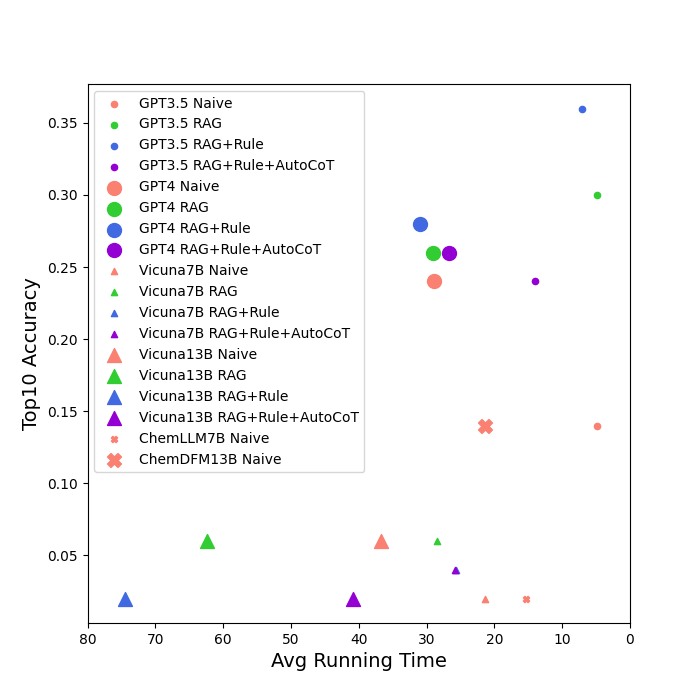

# LLMs Meet Molecular Search
This is a TAMU CSCE670 project: LLMs Meet Molecular Search.
We built an moclecular 

## Demo
Please see [demo.ipynb](demo.ipynb)
The input query includes properties of a molecular, and the output is recommended SMILES expressions, and a reference webset.

### Example:

**Input Query:** {'molecular weight': '55.08 g/mol',
         'density': '772 mg/mL',
         'melting point': '-91.8 C',
         'boiling point': '97.2 C',
         'vapor pressure': '40 mmHg',
         'functional group': ['Primary Amine']}

**Output:**

1: CC(N)=O https://pubchem.ncbi.nlm.nih.gov/compound/178

2: CCC#N https://pubchem.ncbi.nlm.nih.gov/compound/7854 **(This one is what we want.)**

3: O=CC=O https://pubchem.ncbi.nlm.nih.gov/compound/7860

4: CCC#C https://pubchem.ncbi.nlm.nih.gov/compound/7846

5: CC(C)=O https://pubchem.ncbi.nlm.nih.gov/compound/180

6: NC(N)=O https://pubchem.ncbi.nlm.nih.gov/compound/1176

7: O=CC#N https://pubchem.ncbi.nlm.nih.gov/compound/3843063

8: C#CC#N https://pubchem.ncbi.nlm.nih.gov/compound/14055

9: CC1CC1 https://pubchem.ncbi.nlm.nih.gov/compound/11657

10: O=CC#C https://pubchem.ncbi.nlm.nih.gov/compound/12222

## Experiment Results

## Naive Molecular Search
Please see [simple_prompt.ipynb](simple_prompt.ipynb)

## Molecular Search with RAG from QM9
Please see [rag_mol_prompt.ipynb](rag_mol_prompt.ipynb)

## Molecular Search with RAG from QM9 and Rules
Please see [rag_mol_rule_prompt.ipynb](rag_mol_rule_prompt.ipynb)

## Molecular Search with RAG from QM9, Rules, and Auto-CoT prompts
Please see [rag_mol_rule_auto_cot_prompt.ipynb](rag_mol_rule_auto_cot_prompt.ipynb)

